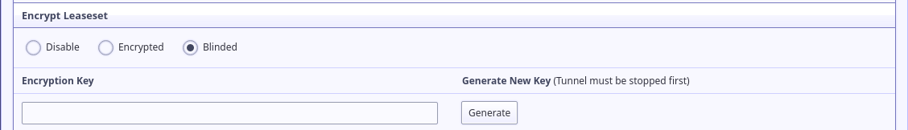
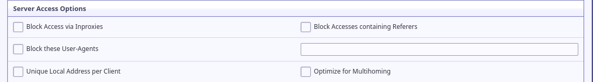
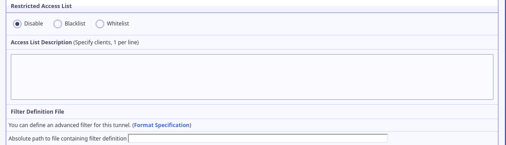
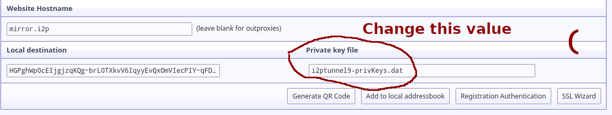

Process Two: Forward your service to an eepSite
-----------------------------------------------

Congratulations! You've completed the most difficult part. From here on, the
decisions you must make, and the consequences that they will have, are much
more straightforward and easy to enumerate. Such is the beauty of a
cryptographically secure network layer like I2P!

### Step three: Generate your .i2p Tunnels and Addresses

For eepSites, you will need to create an HTTP Server Tunnel. This is
an I2P destination with a few special features for hosting HTTP services to
enable things like rate-limiting, filtering, and the inclusion of headers to
identify the destination of the client to the server. These enable flexibility
in how you handle connections in terms of load-balancing and rate-limiting on
a case-by-case basis, among other things. Explore these options and how they
relate to the applications which you considered in step one, even though a very
simple setup is easy, larger sites may benefit from taking advantage of these
features.

#### Create an HTTP Tunnel for your application

If you've configured a reverse proxy or an SSH tunnel before, then the general
idea here should be very familiar to you. I2PTunnel, in essence, is just
forwarding ports from the host to the I2P Network. To set this up using the web
interface, go to the I2PTunnel configuration page.

At the bottom of the "I2P Hidden Services" section of the page, select an HTTP
Service from the drop-down and click "Create."

It will immediately drop you into the granular tunnel configuration page, which
we're about to explore from top-to-bottom. The first, most essential settings
are the tunnel name and the target host:port. **The target host:port is**
**the place where you input the address of the service you are forwarding to**
**I2P**. Once you've configured that, your web site will become available over
i2p. However, there are probably a few things that we can improve.

Next, you may want to pick a hostname to use for your eepSite. This hostname
doesn't need to be universally unique, for now, it will only be used locally.
We'll publish it to an address helper later. **If** the *Local Destination*
field isn't populated with your Base64 Destination yet, you should scroll down
to the bottom, save the tunnel configuration, and return to the tunnel
configuration.

A little further down the configuration page, the tunnel options are available.
Since you've got a site which is not intended to be anonymous, but rather to
provide anonymous access to others by an alternate gateway, it may be good to
reduce the number of hops the tunnel takes on the I2P network.

Next are the encrypted leaseset options. You can probably leave these as the
defaults, since your site isn't anonymous it probably doesn't need features like
blinding or encrypted leasesets. If you were to choose encrypted leasesets, you
would not be accessible to anyone unless you shared a key with them in advance.

The next few parts may be especially useful to you if you run a high-traffic
site or find yourself subject to DDOS attacks. Here you can configure various
kinds of connection limits.

After that, there are a few other ways of filtering connections by client
characteristics. First, you can block access via inproxies like I2P.to and
similar. Since you have a clearnet presence already, changing this may be better
if you want to encourage I2P users to only use your eepSite. You can also block
accesses via specific user-agents, for instance blocking wget may be helpful if
you want to prevent spidering. Finally, and of particular interest to Fail2Ban
users, the "Unique local address per client" will give each client it's own
local IP address instead of them all appearing to the server to be from
127.0.0.1.

You can probably leave these next few options to the defaults.

Lastly, you can set up an advanced filter definition. Writing filters is beyond
what I'm prepared to do in this document, for more information see the format
specification for now.

#### Multi-Home an Application

One interesting thing that I2P can do is host the same site on multiple servers
at the same time transparently, which is referred to as "Multihoming." In order
to multihome your application, you will need to return to the tunnel menu and
change the location of your private key file to it's own, non-shared location.

When you're done, copy the new key file for your new multihomed service to a
storage device. Now, you can re-produce your service/tunnel configuration with
those same keys on any I2P router and increase your service's redundancy.

### Step four: Publicize and Authenticate your eepSite

Since you're running

#### Place your .b32.i2p link on your clearnet page

#### Distributing an "Addresshelper" link from your clearnet page

#### Create a subscribable address feed

#### Distributing
