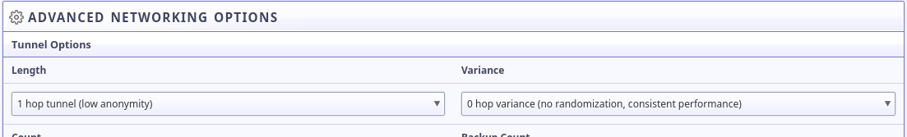

How to offer your existing Web Site as an I2P eepSite
=====================================================

A somewhat meta-tutorial and guided tour of mirroring a clear-web site to I2P.
Unfortunately, it's probably impossible to *completely* cover all possible cases
of making an existing web site available as an eepSite, there's simply too
diverse an array of server-side software, not to mention the in-practice
peculiarities of any particular deployment of software. Instead, I'm going to
try and convey, as specifically as possible, the general process preparing a
service for deployment to the eepWeb or other hidden services.

Much of this guide will be treating the reader as a conversational participant,
in particular If I really mean it I will address the reader directly(i.e. using
"you" instead of "one") and I'll frequently head sections with questions I think
the reader might be asking. This is, after all, a "process" that an
administrator must consider themselves "involved" in just like hosting any other
service.

DISCLAIMERS:
------------

While it would be wonderful, it's probably impossible for me to put specific
instructions for every single kind of software that one might use to host web
sites. As such, this tutorial requires some assumptions on the part of the
writer and some critical thinking and common sense on the part of the reader.
To be clear, **I have assumed that the person following this tutorial is**
**already operating a clear-web service linkable to a real identity or**
**organization** and thus is simply offering anonymous access and not
anonymizing themselves.

Thus, **it makes no attempt whatsoever to anonymize** a connection from one
server to another. If you want to run a new, un-linkable hidden service that
makes server-to-server connections, additional steps will be required and will
be covered in another tutorial.

That said: If you can be sure that a *brand new service* which is *not*
*available to the clear-web* will never make a server-to-server connection and
will not leak server metadata in responses to clients, then services configured
in this way will be anonymous.

Process One: Prepare your Server
--------------------------------

### Step one: Determine what software you are running

In practice, your web service probably uses a number of things to enhance it's
reliability and security. These things could be proxies, reverse proxies,
containers, tunnels, Intrusion Detection Systems, rate-limiters, load balancers,
among many other things. When you get started, you should go through your
deployment and determine which software you are using, and what you are using it
for.

#### As you examine your software, ask yourself these questions

These questions should help you evaluate what parts of your software stack are
relevant to your I2P eepSite.

##### Does this software work based on IP addresses?

If you are using software which alters the behavior of traffic based on the IP
address of the sender, these things will probably not work with I2P, or may work
in complicated or unexpected ways. This is because the address will usually be
the localhost, or at least the host where your I2P router is running. Software
which sometimes does things based on IP addresses could be Fail2Ban, iptables,
and similar applications.

##### Does this software work by "Tagging" traffic with additional metadata?

Some software may be configured to add information to the traffic it handles.
Obviously, if this information is identifying it should not be part of the chain
of services that is exposed to the I2P network.

##### Does this software work by communicating with a remote resource? What triggers this behavior?

Some software may also draw from remote resources, to find up-to-date rules and
block lists which can be used to prevent attacks. Some of these might be useful
as part of the service that is exposed to I2P, but you should make sure that the
rules are applicable and that a rules update cannot be triggered as a result of
a normal client request. This would create a server-to-server communication
which could reveal the timing of an I2P communication to a third party.

### Step two: Determine which port to Forward to I2P and Optionally locate your TLS certificate

Now you've gathered all the information that you will require to forward your
service to I2P. Once you've selected the point at which you would like to make
your site available to I2P, you will need to note the port you wish to foward.
In simple scenarios, this will probably just be port 80 or port 8080. In more
sophisticated scenarios, this might be a reverse proxy or something like that.
Make a note of the port.

#### Establishing a Common Identity for both the Clearnet and your eepSite

Should you be a non-anonymous organization that wishes to provide enhanced
privacy to your users by providing a hidden service, you may wish to establish
a common identity between versions of your site. However, since we can't add
[.i2p domains to clearnet TLS certificates](/IDENTITY/tls.html), we have to do
this in another way. To do this, **even if you are forwarding the HTTP port**
**and not HTTPS**, make a note of the location of your TLS certificate for use
in the final step.

Process Two: Forward your service to an eepSite
-----------------------------------------------

Congratulations! You've completed the most difficult part. From here on, the
decisions you must make, and the consequences that they will have, are much
more straightforward and easy to enumerate. Such is the beauty of a
cryptographically secure network layer like I2P!

### Step three: Generate your .i2p Tunnels and Addresses

For eepSites, you will need to create an HTTP Server Tunnel. This is
an I2P destination with a few special features for hosting HTTP services to
enable things like rate-limiting, filtering, and the inclusion of headers to
identify the destination of the client to the server. These enable flexibility
in how you handle connections in terms of load-balancing and rate-limiting on
a case-by-case basis, among other things. Explore these options and how they
relate to the applications which you considered in step one, even though a very
simple setup is easy, larger sites may benefit from taking advantage of these
features.

#### Create an HTTP Tunnel for your application

If you've configured a reverse proxy or an SSH tunnel before, then the general
idea here should be very familiar to you. I2PTunnel, in essence, is just
forwarding ports from the host to the I2P Network. To set this up using the web
interface, go to the I2PTunnel configuration page.

At the bottom of the "I2P Hidden Services" section of the page, select an HTTP
Service from the drop-down and click "Create."

It will immediately drop you into the granular tunnel configuration page, which
we're about to explore from top-to-bottom. The first, most essential settings
are the tunnel name and the target host:port. **The target host:port is**
**the place where you input the address of the service you are forwarding to**
**I2P**. Once you've configured that, your web site will become available over
i2p. However, there are probably a few things that we can improve.

Next, you may want to pick a hostname to use for your eepSite. This hostname
doesn't need to be universally unique, for now, it will only be used locally.
We'll publish it to an address helper later. If the *Local Destination* field
isn't populated with your Base64 Destination yet, you should scroll down to the
bottom, save the tunnel configuration, and return to the tunnel configuration.

A little further down the configuration page, the tunnel options are available.
Since you've got a site which is not intended to be anonymous, but rather to
provide anonymous access to others by an alternate gateway, it may be good to
reduce the number of hops the tunnel takes on the I2P network.

Next are the encrypted leaseset options. You can probably leave these as the
defaults, since your site isn't anonymous it probably doesn't need features like
blinding or encrypted leasesets.

#### Multi-Home an Application

One interesting thing that I2P can do is host the same site on multiple servers
at the same time transparently, which is referred to as "Multihoming."

### Step four: Publicize and Authenticate your eepSite

#### Place your .b32.i2p link on your clearnet page

#### Distributing an "Addresshelper" link from your clearnet page

#### Create a subscribable address feed

#### Distributing
See Also:
---------

Most of the security issues of hosting Tor hidden services also apply to I2P. It
would be advisable to take advantage of their resources as well as this one:

### Misc Links

 * [Official Guide](https://2019.www.torproject.org/docs/tor-onion-service.html.en)
 * [Riseup best Practices](https://riseup.net/en/security/network-security/tor/onionservices-best-practices)
 * [Blog about config fails](https://blog.0day.rocks/securing-a-web-hidden-service-89d935ba1c1d)
 * [Whonix Docs Onion Service](https://www.whonix.org/wiki/Onion_Services)
 * [Reddit thread](https://old.reddit.com/r/TOR/comments/bd5aqc/can_my_server_trade_off_privacy_for_speed_and/)

### Stack Exchange

 * [Hosting clearnet site as onion service](https://tor.stackexchange.com/questions/16680/hosting-site-as-hidden-service)
 * [Securing a Tor Hidden Service](https://tor.stackexchange.com/questions/58/securely-hosting-a-tor-hidden-service-site)
 * [Effects of hosting hidden and non-hidden services](https://tor.stackexchange.com/questions/6014/does-hosting-a-tor-hidden-service-also-on-clearnet-dns-reduce-privacy-security-f)

### Clearnet Web Sites announcing Public Services:

 * [Propublica](https://www.propublica.org/nerds/a-more-secure-and-anonymous-propublica-using-tor-hidden-services)
 * [Wikipedia Proposal](https://meta.wikimedia.org/wiki/Grants_talk:IdeaLab/A_Tor_Onion_Service_for_Wikipedia)
